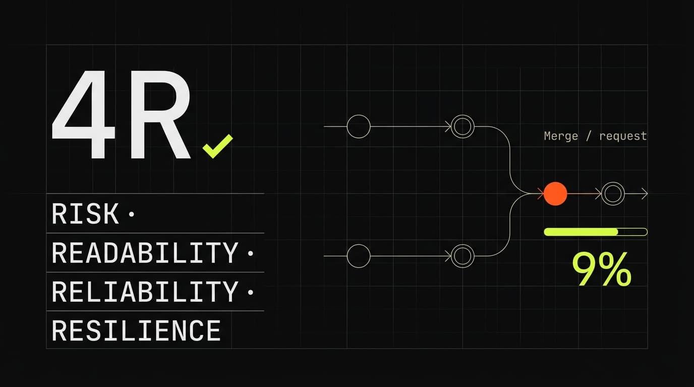

# 4R — AI Merge Request Reviewer

Self-hosted AI code review for **GitLab merge requests**, built around the **4R
quality framework** — **R**isk, **R**eadability, **R**eliability, **R**esilience.

You configure your GitLab accounts and an AI provider, track repositories, and
run a review on any open merge request. The engine loads the 4R rule sets,
sends the diff to the model, and produces **located, structured findings** with
a deterministic score and an approve / request-changes recommendation. You then
choose which findings to publish back to the MR as inline discussions — and can
optionally rewrite them in your own voice before sending.

> Status: **usable, single-user, GitLab-first.** Backend and web client are both
> feature-complete for the core review loop (configure → review → publish), with
> Telegram notifications and a humanize pass. Automation (webhooks, bot commands)
> and GitHub support are on the [roadmap](#roadmap).

## Why 4R

Every change is reviewed through four lenses so the issues that matter most are
caught before they reach production — without slowing down changes that are
genuinely safe:

| Lens | Question |
|---|---|
| **R1 · Risk** | Can this harm security, data, or production stability? |
| **R2 · Readability** | Will the next engineer understand it without an hour of digging? |
| **R3 · Reliability** | Does it behave correctly across the realistic range of inputs? |
| **R4 · Resilience** | Does it degrade gracefully when dependencies fail or slow down? |

## Features

- **GitLab MR review** — list open MRs, fetch the diff (fast) or shallow-clone
  for deeper context (deep), run the 4R engine, publish selected findings.
- **Deterministic scoring** — the recommendation and 0–100 score are computed
  from findings, not asked of the model.
- **Phased, multi-pass reviews** — each 4R lens runs as its own pass with live
  progress, so results stream in instead of arriving all at once.
- **Multiple AI providers** — OpenAI-compatible (Groq, OpenAI, Moonshot, Kimi,
  OpenRouter) and Anthropic (Claude), with a default provider, a per-repo
  provider/model, and a per-review override chosen at launch.
- **Humanize** — capture your writing voice into style profiles and generate
  humanized versions of the summary and each finding, publishable per card.
- **Review lifecycle** — reviews run async with status polling; **retry** clones
  the review (keeping the failed one for history), and you can **cancel**,
  **archive**, or **delete** from the detail view or the lists.
- **Telegram notifications** — register targets (bot token + chat, optional
  topic thread), get pinged when a review finishes, send a test message, and
  **resolve** recent chats/threads straight from `getUpdates` so you pick a
  destination instead of copying IDs.
- **Secrets encrypted at rest** — GitLab tokens, provider API keys, and bot
  tokens are AES-256-GCM encrypted; the API never returns them.
- **Selective publishing** — pick which findings become inline discussions, or
  comment them all; already-published findings are never re-posted.
- **Responsive web UI** — a desktop sidebar and a mobile bottom-nav / "More"
  layout over the same feature set.

## Architecture

A monorepo. The backend owns all state and is the single contract every client
consumes over HTTP.

```
packages/
  server/   Go 1.26 backend — hexagonal, SQLite (single binary), REST API
  spa/      Vue 3 + TypeScript + Vite + UnoCSS + Pinia web client
docs/       API reference, design notes, banner prompt
```

- **Backend**: Go + SQLite (`modernc.org/sqlite`, pure-Go → single binary), an
  encrypted secret vault, a bounded job runner, and the 4R engine behind
  strategy interfaces (fast/deep context × single/multi-pass). Adapters for
  GitLab (clone + REST) and Telegram (Bot API) live at the edges.
- **Web**: file-based routing, feature modules, a borderless technical-minimal
  design system.

## Quick start

Requires **Go 1.26+**, **Node 22+** / **bun**, and **git**.

```sh
# run backend + SPA together (backend :8080, SPA :5173)
make dev

# …or separately
make run-server
make run-spa
```

Then open <http://localhost:5173>. The Vite dev server proxies `/api` to the
backend, so no CORS setup is needed.

> **Deep reviews clone over HTTPS.** The GitLab token must include the
> `read_repository` scope (in addition to `api`) — an `api`-only token passes
> fast reviews but is rejected at clone time.

### Configuration (backend env vars)

| Variable | Default | Purpose |
|---|---|---|
| `AIR_HTTP_ADDR` | `:8080` | Listen address |
| `AIR_DB_PATH` | `ai-reviewer.db` | SQLite database file |
| `AIR_PASSWORD` | _(empty)_ | Unlocks the secret vault; empty → key-file mode |
| `AIR_KEYFILE_PATH` | `<db>.key` | Master key file (key-file mode) |
| `AIR_SKILLS_DIR` | _(empty)_ | Override dir for the 4R rule files |
| `AIR_REVIEW_CONCURRENCY` | `2` | Max reviews running in parallel (min 1) |

## Make targets

```
make            # help
make dev        # backend + SPA together
make run-server # backend only
make run-spa    # SPA only
make build      # compile the server binary to ./bin
make test       # server test suite
make vet        # go vet
make fmt        # go fmt
make clean      # remove build artifacts and local db files
```

The SPA has its own scripts (run from `packages/spa` with `bun run`):
`dev`, `build`, `type-check`, `test:unit`, `lint`.

## API

The HTTP API is the contract for every client. See **[docs/API.md](docs/API.md)**
for the full reference and **[docs/api.http](docs/api.http)** for a runnable
request collection.

## Roadmap

Not built yet:

- **GitHub support** — the review pipeline is GitLab-only today (clone + PR
  fetch + publish adapter needed).
- **Webhook auto-trigger** — kick off a review automatically when an MR is
  opened or updated.
- **Telegram bot commands** — trigger a review and publish results from chat
  (notifications and chat/thread resolving already ship).
- **Add repos by search** — list a GitLab account's projects and pick one,
  instead of pasting a URL.
- **Auth & multi-user** — request authentication, OAuth, multiple accounts.
- **Loading polish** — skeletons and progress indicators; an enhanced review
  detail view behind a toggle.
