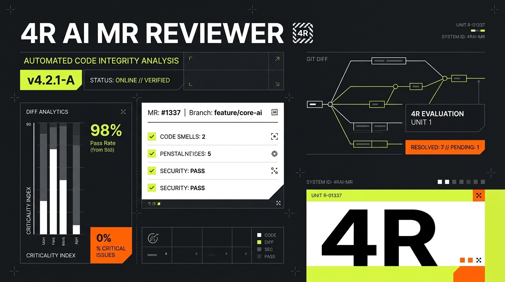

# 4R AI MR & PR Reviewer



4R AI MR & PR Reviewer is a self-hosted developer productivity tool that automatically reviews Merge Requests (GitLab) and Pull Requests (GitHub) using modern Large Language Models. It executes a comprehensive multi-step analysis across **4 critical pillars (the 4R Framework)** to deliver deep, structured, and actionable code insights directly to your developers.

---

## 🚀 The 4R Framework

Rather than doing a generic, one-pass review, the system runs four distinct auditing steps sequentially:

1. **🔒 Risk**
   * Detects hardcoded secrets, API keys, credentials, or DB URLs.
   * Highlights client-side authorization bypass risks.
   * Flags insecure data sinks prone to SQL injection, XSS, or path traversal.
   * Audits security-sensitive settings (e.g., cookie flags).

2. **📖 Readability**
   * Identifies complex or convoluted logic that hurts maintainability.
   * Audits naming conventions, API clarity, comments, and structure.
   * Assesses code documentation, typing, and standard design pattern usage.

3. **🛠️ Reliability**
   * Analyzes state handling, variable scope leaks, and concurrent race conditions.
   * Verifies error propagation, exception safety, and resource leaks.
   * Inspects edge cases, off-by-one errors, and type boundary validation.

4. **⚡ Resilience**
   * Evaluates how the code recovers from third-party API or network failures.
   * Assesses timeouts, retries, and fallback mechanisms.
   * Checks database transaction rollbacks, lock contentions, and resource exhaustion.

---

## 🛠️ Technology Stack

* **Backend**: Go (version 1.26+) utilizing `modernc.org/sqlite` for database management.
* **Frontend**: Vue 3 (Composition API), Vite, TypeScript, Bun package manager, and UnoCSS.
* **AI Providers**: Fully configurable integration with Claude (Anthropic), Groq, OpenAI, Moonshot, kimi, and OpenRouter.
* **Notifications**: Telegram Bot integration for live MR alert channels and interactive command triggers.

---

## ⚙️ Configuration & Quick Start

The application is configured using environment variables:

| Variable | Description | Default |
|----------|-------------|---------|
| `AIR_HTTP_ADDR` | Server bind address and port | `:8080` |
| `AIR_DB_PATH` | Path to SQLite database file | `ai-reviewer.db` |
| `AIR_PASSWORD` | Optional master password for DB privacy | *(Empty/Key-file mode)* |
| `AIR_SKILLS_DIR` | Custom prompt/review skills directory | *(Optional)* |

### Developer Commands

All development tasks are automated via the root [Makefile](file:///home/webcloster-dev/Development/Repos/PRODUCTIVITY/ai-reviewer-5/Makefile):

* **Run Backend + Frontend Dev Server (recommended)**:
  ```bash
  make dev
  ```
* **Start Server Only**:
  ```bash
  make run-server
  ```
* **Start Single Page Application Only**:
  ```bash
  make run-spa
  ```
* **Compile Server Production Binary**:
  ```bash
  make build
  ```
* **Run Tests**:
  ```bash
  make test
  ```
